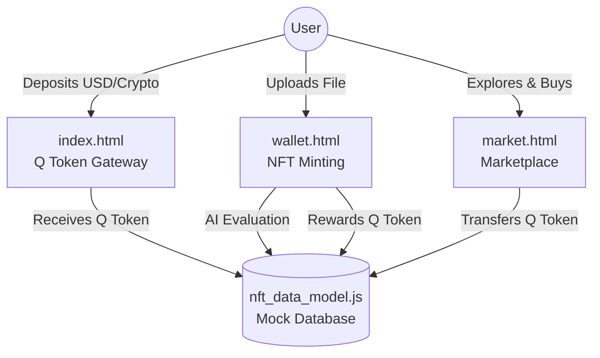

# Q Token & NFT Ecosystem (Formerly AI Token Index)


**Q Token & NFT Ecosystem** is a complete decentralized application (dApp) simulation bridging the AI Token Economy with Digital Asset Ownership (NFTs). Built upon the original AI Token Index, it provides a comprehensive marketplace where users can swap fiat/crypto into Q Tokens, mint digital files into AI-evaluated NFTs, and trade them on a highly visual marketplace.

---

## 🔥 Key Features

### 1. 🪙 Q Token Gateway (`index.html`)
The financial hub of the ecosystem.
- **Deposit Q Tokens:** Real-time conversion widget to swap USD, EUR, Gold (XAU), or Crypto (BTC, ETH) into Unit Q.
- **AI Token Pricing:** Live pricing context derived from major AI models (GPT-4o, Gemini 2.5, DeepSeek-V3, Claude 3.5).
- **Live Wallet Sync:** Directly linked to your personal Q Wallet to display your available balance.

### 2. 👛 Q Wallet & NFT Minting (`wallet.html`)
A premium dashboard to manage your Q Tokens and digital assets.
- **Upload & Evaluate:** Submit images, audio, video, 3D models, or code.
- **AI Valuation Algorithm:** Simulates an AI evaluator that scores your file quality and determines its intrinsic Q Token reward value.
- **NFT Gallery:** View your owned NFTs.
- **Burn Mechanism:** Permanently destroy an NFT to reclaim 70% of its original Q Token value.

### 3. 🛒 NFT Marketplace (`market.html`)
A highly visual, Metaplex-inspired digital market.
- **Explore Digital Assets:** Filter NFTs by Category (Digital Art, 3D Models, Video, Audio, Code).
- **Market Data:** View live prices, creators, and the "AI Quality Multiplier" for each listed asset.
- **Purchase:** Buy NFTs using your deposited Q Tokens directly from the market.

### 4. 🧠 AI Models Terminal (`ai-models.html`)
A dedicated guide providing in-depth analysis of costs and performance for the world's leading AI models.

---

## 🛠️ Technology Stack

- **Frontend:** HTML5, Vanilla CSS3 (Custom Design System with Glassmorphism and Neon Gradients), JavaScript (ES6+).
- **Architecture:** Client-side state management mapping the complete user flow (`nft_data_model.js`).
- **Mobile App (Optional):** Next.js 14, Tailwind CSS inside `/unit-q-app`.

---

## 🏗️ Architecture Summary



> 📘 **Deep Dive**: Read the [NFT System Architecture (ARCHITECTURE_NFT.md)](ARCHITECTURE_NFT.md) for the detailed mathematical blueprint of the Minting algorithm and database schema.

---

## 🎨 Design System

- **Primary Colors:** `#D4AF37` (Gold Leaf), `#00d2ff` (Neon Blue), `#0B0E11` (Obsidian Dark).
- **Typography:** *Outfit* for headings, *JetBrains Mono* for numerical and code data.
- **Vibe:** Premium, futuristic, and high-trust financial engineering.

---

## 🚀 Getting Started

1.  **Clone the repository:**
    ```bash
    git clone https://github.com/9dpi/token.git
    ```
2.  **Launch the Ecosystem:**
    Simply open `index.html` in any modern browser to start your journey. No backend setup required for the prototype.

---

## 📄 Attribution

Created and maintained by **9DPI**. Powered by **Quantix AI Core**.

© 2026 Q Token Ecosystem. Gateway to AI Economy.
