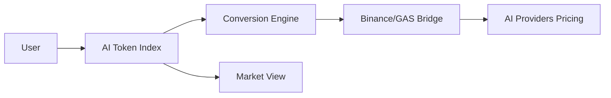

# AI Token Index — Gateway to AI Economy


**AI Token Index** is a premium dashboard and real-time conversion hub designed to bridge the gap between traditional assets and the burgeoning AI economy. It provides investors and developers with a clear view of AI token valuations across major providers like OpenAI, Anthropic, Google, and DeepSeek.

---

## 🔥 Key Features

### 1. 🪙 Real-Time AI Token Converter
The industry's first multi-asset to AI token calculator. 
- **Input Assets:** USD, EUR, GBP, AUD, Gold (XAU), Bitcoin (BTC), Ethereum (ETH).
- **AI Targets:** 
  - 🤖 **GPT-4o** (OpenAI)
  - ♊ **Gemini 2.5** (Google)
  - 🧠 **DeepSeek-V3** (DeepSeek)
  - 🏺 **Claude 3.5** (Anthropic)
  - 🪙 **Unit Q** (Quantix Core)

### 2. 📊 Market Overview Terminal
A professional-grade monitoring table focused on primary fiat and metal pairs converted to AI Token value.
- **Top Pairs:** EUR/USD, GBP/USD, GOLD/USD.
- **Live Data:** Integration with Binance API for real-time market accuracy.
- **Visuals:** Dynamic sparklines and interactive technical charts.

### 3. 🛡️ Professional Market Terminal
A dedicated page for technical analysis featuring:
- **ApexCharts** integration for candlestick/line data.
- **Execution Logs:** Simulated real-time order flows.
- **Risk Analysis:** AI-powered risk assessment indicators.

### 4. 📱 Mobile-First Design
Fully responsive architecture with a dedicated **Next.js Mobile App** for high-frequency monitoring and chat interface.

---

## 🛠️ Technology Stack

- **Frontend:** HTML5, Vanilla CSS3 (Custom Design System), JavaScript (ES6+).
- **Charts:** ApexCharts.js.
- **Mobile App:** Next.js 14, Tailwind CSS, TypeScript.
- **Backend:** Google Apps Script (as an API Bridge) & Google Sheets (Database).
- **APIs:** Binance API for live FX & Crypto rates.

---

## 🏗️ Architecture Summary



---

## 🎨 Design System

- **Primary Colors:** #D4AF37 (Gold Leaf), #0B0E11 (Obsidian Dark).
- **Typography:** *Outfit* for headings, *JetBrains Mono* for numerical data.
- **Vibe:** Premium, modern, and high-trust financial engineering.

---

## 🚀 Getting Started

1.  **Clone the repository:**
    ```bash
    git clone https://github.com/9dpi/token.git
    ```
2.  **Open locally:**
    Launch `index.html` in any modern browser.
3.  **Mobile App:**
    Navigate to `/unit-q-app` and run:
    ```bash
    npm install
    npm run dev
    ```

---

## 📄 Attribution

Created and maintained by **9DPI**. Powered by **Quantix AI Core**.

© 2026 AI Token Index. Gateway to AI Economy.
